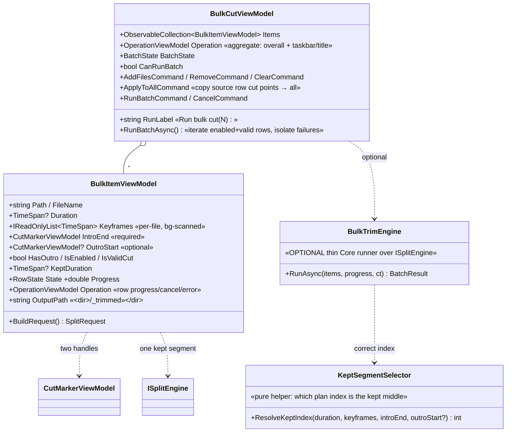

# D-004 — Bulk Cut tab (batch intro + optional-outro trim)

> Status: **draft** · a third screen tab that trims the long intro (and optional outro) off **many videos at once**,
> stream-copy only, to shrink files fast. Companion: [`./core-flow.md`](./core-flow.md) (batch-run flow + full edge matrix).

---

## Concept & mental model

Many videos — especially same-series episodes — carry a long intro (and often an end-credits outro). Trimming those
off shrinks the files and is pure housekeeping. Doing it one-at-a-time in the Split tab is tedious. **Bulk Cut** is a
third tab that takes a **list of videos**, lets you mark each one's **intro-end** (and optional **outro-start**) on a
per-row scrub bar, and trims them all in one run — **keeping the middle** `[intro-end → outro-start]` of each.

**The core mental model:** a bulk trim *is a Split that keeps exactly one middle segment.* Everything that makes Split
correct — keyframe-snapping, `-c copy`, temp-then-move cancel-safety, disk pre-flight, the copy-invariant assertion —
is **reused verbatim**. Bulk Cut adds a **list + two cut points per row + a batch runner**, not a new ffmpeg path.

```
one video:   ▮▮▮ intro  │◀───────  KEEP  ───────▶│  outro ▮▮
                         intro-end            outro-start
             drop ◀──────┘                        └──────▶ drop      (outro optional → keep runs to EOF)
             output → <same folder>/<name>_trimmed<ext>   (original kept)
```

## Scope (in / out)

**In (v1):**
- A third tab **"Bulk Cut"** (`SelectedTabIndex == 2`), sibling to Split (0) / Join (1).
- Add many videos (multi-select + drag-drop); a scrollable **list of rows**, one per video.
- Per row: a **mini scrub bar with two handles** — intro-end (required-ish) + optional outro-start — marked visually,
  keyframe-snapped, with the kept middle span highlighted.
- **Apply-to-all**: copy one row's cut points to every other row (same-series batches in one click).
- **Run** trims all enabled rows sequentially; per-row + overall progress (taskbar + title); failure-isolated.
- Output: `<name>_trimmed<ext>` in the **source folder**; **originals never touched**.

**Out (v1):** see [§ Out of scope](#out-of-scope) — auto-detecting intros, frame-exact cuts, custom output folders,
multiple kept segments per video, >1 row per source, codec conversion, output-name templates, folder/watch import.

---

## The model — types, reuse map, new components

**Reused wholesale (no new ffmpeg path, no second engine):**

| Reused | From | How Bulk Cut uses it |
|---|---|---|
| `ISplitEngine.SplitAsync(req, progress, ct, status, partProgress)` | `Core/Split/SplitEngine.cs` | Per row: one kept-middle-segment extraction (`-ss` before `-i`, `-c copy`, `-avoid_negative_ts make_zero`). |
| `SplitRequest` record | `Core/Split/SplitRequest.cs` | `InputPath`, `CutPoints=[introEnd(,outroStart)]`, `OutputDir=<source dir>`, `NamingPattern="{name}_trimmed{ext}"`, `Overwrite=false`, `SelectedSegmentIndices=[kept middle]`. |
| `MediaProbe` — `ProbeAsync` / `GetKeyframesAsync` / `SnapToNearestKeyframe` / `AverageGop` | `Core/Media/MediaProbe.cs` | Per-file duration + keyframe scan (cached, in-flight-deduped) + per-handle snapping. **Share the same instance** the other tabs use. |
| `CutMarkerViewModel` (snap-aware cut point, live `requested→snapped (±Δ)` display) | `App/ViewModels/CutMarkerViewModel.cs` | **Two per row** — the intro-end + optional outro-start handles. Snap preview for free. |
| `OperationViewModel` (progress / cancel / error / ETA / taskbar state) | `App/ViewModels/OperationViewModel.cs` | **One per row** (row progress) **+ one aggregate** on the tab VM (overall bar + taskbar/title). |
| Join's multi-file list scaffold (`ObservableCollection`, `AddFilesAsync`, remove/clear, drop-highlight, `LastInputDir`) | `App/ViewModels/JoinViewModel.cs` | The list shell copied for the Bulk list. |
| `SplitViewModel.RunSplitAsync` + `StartKeyframeIndex` | `App/ViewModels/SplitViewModel.cs` | Templates for a single row's run + per-row background keyframe indexing (stale-CTS guard). |
| `IThumbnailService` / `ThumbnailPreviewViewModel` | `Core/Thumbnails/*`, `App/ViewModels/ThumbnailPreviewViewModel.cs` | Hover-thumbnail on each row's scrub bar (same as Split). |
| `FfmpegErrorMapper` / `ErrorLogWriter` / `EnsureEnoughFreeSpace` | `Core/*` | Per-row friendly errors + copyable log + disk pre-flight. |

**New components (all WPF-free VMs / view-only rendering):**



- **`BulkCutViewModel`** — the tab VM: the list, aggregate operation, apply-to-all, `RunBatchAsync` (sequential loop,
  failure-isolated). Mirrors `JoinViewModel` + `SplitViewModel.RunSplitAsync`.
- **`BulkItemViewModel`** — one row: Join-item shape + two `CutMarkerViewModel` handles + per-file keyframes + its own
  `OperationViewModel` + `RowState` + `BuildRequest()`.
- **`BulkCutView`** (+ per-row scrub control) — the XAML: an `ItemsControl` of row cards; each row's dual-handle scrub
  bar is a **view-only Canvas rendering of VM offsets** (like `TimelineView`), so `CoreIsUiFreeTests` stays green.
- **`BulkTrimEngine` / `KeptSegmentSelector`** (optional, recommended) — a thin **Core** batch runner + a pure helper
  that computes *which* plan index is the kept middle (see the [index risk](#risks--unknowns)); keeping them in Core
  makes the batch loop + index math unit-testable with a fake `ISplitEngine`. If skipped, the loop lives in the VM and
  emits `SplitArgsBuilder.PerSegment([introEnd..outroStart|EOF])` directly (bypassing `SelectedSegmentIndices`).

**Integration points** (additive; tabs 0/1 undisturbed):
- `MainViewModel` (both ctors) — construct `BulkCut = new BulkCutViewModel(probe, splitEngine, thumbnailService, settings)` sharing the existing instances; expose `public BulkCutViewModel BulkCut`; add `BulkCut.Operation` to `HookOperations()`.
- `MainViewModel` tab routing — generalize the 2-tab `SelectedTabIndex == 1` / `IsJoinActive` logic to **3-way** (`switch 0/1/2`): `CurrentOperation` → Bulk's **aggregate** op when `==2`; `CurrentClearCommand` → `Bulk.ClearCommand`; `CurrentLoadLabel="Add videos…"`, `CurrentClearLabel="Clear all"`, + both tooltips.
- `MainWindow.xaml` — add `<TabItem Header="Bulk Cut"><views:BulkCutView DataContext="{Binding BulkCut}"/></TabItem>` after Join. Taskbar/title already bind `CurrentOperation.*` → follow the new tab automatically.
- `MainWindow.xaml.cs` `Load_Click` — add an `==2` branch opening the Bulk add-files picker (reuse `VideoFileFilter` + `LastInputDir`).
- `IAppSettings` (optional) — a persisted `DefaultIntroSeconds?` to pre-seed each new row's intro handle (same-series convenience); follow the nullable-key + DTO round-trip pattern. No output-dir setting needed (same-folder rule).

## Fields (per row unless tagged [tab])

| Field | Type | Req | Default | Notes |
|---|---|:--:|---|---|
| `Path` / `FileName` | string | ✓ | ctor / `GetFileName` | Dedup key = normalized `GetFullPath`. One row per file (v1). |
| `Duration` | TimeSpan? | | null | `ProbeAsync`; upper bound for both handles; outro-EOF fallback = `Duration`. |
| `SizeBefore` / `SizeAfter` | long / long? | | 0 / null | `SafeFileSize`; feeds the "shrinks ~X→Y" estimate + disk pre-flight. |
| `Keyframes` / `IsIndexingKeyframes` / `KeyframesReady` | list / bool / bool | | empty / true / false | Per-file bg scan (cached, deduped); handles placeable optimistically while indexing. |
| `IntroEndRequested` / `IntroEndSnapped` / `IntroEndDelta` | TimeSpan(s) | ✓ | 0 | Stored **requested** (apply-to-all re-snaps per file); snapped = the real `-ss` start; delta surfaced. |
| `OutroStartRequested?` / `…Snapped?` / `…Delta?` | TimeSpan? | | null | Optional. null ⇒ keep→EOF (omit `-to`). Snap ≥ EOF ⇒ treated as no outro (warn). |
| `HasOutro` | bool | ✓ | false | `OutroStartRequested != null`. |
| `KeptDuration` | TimeSpan? | | null | `(OutroStartSnapped ?? Duration) − IntroEndSnapped`; must exceed `MinKeptSpan`. |
| `IsValidCut` | bool | ✓ | false | `KeyframesReady && introEnd < (outro ?? Duration) − MinKeptSpan && in-range`. Gates run. |
| `IsEnabled` | bool | ✓ | true | Row-in-batch checkbox; auto-forced false when invalid / no-op. |
| `OutputPath` | string | ✓ | `<dir>/{name}_trimmed{ext}` | Deterministic; ext inherited from source; collision per policy. |
| `Progress` / `State` / `Error` / `Warning` | double / enum / err? / str? | ✓ | 0 / Pending / null / null | One ffmpeg run == one row ⇒ natural per-row %; state drives the chip. |
| `[tab] Items` | ObservableCollection | ✓ | empty | Join's list. `CollectionChanged` → recompute counts + `CanRunBatch`. |
| `[tab] CollisionPolicy` | enum | ✓ | **AutoSuffix** | `Skip \| Overwrite \| AutoSuffix(_trimmed_2/_3)`. Never clobbers the source. |
| `[tab] BatchState` / `CanRunBatch` / `BatchResult` | enum / bool / list | ✓ | Idle / false / empty | Drives Run/Cancel + the end-of-batch failure-isolation ledger. |

## Behaviour — states + batch-run flow

**Row lifecycle:** `Loading → Ready │ Invalid │ NoOpTrim │ LoadFailed` → (batch) `Queued → Running → Done │ Failed │ Skipped │ Cancelled`.
**Batch lifecycle:** `Idle → Preparing → Running → (Completed │ CompletedWithFailures │ Cancelled)`.

Full run/validation flow + the complete edge-case matrix live in [`./core-flow.md`](./core-flow.md). In short: **Preparing**
awaits still-indexing rows, resolves pending handle-snaps, runs a disk pre-flight, resolves output collisions; **Running**
iterates enabled+valid rows head-to-tail, each an independent temp-then-move `-c copy`; **one row's failure never aborts
the batch** (caught → mapped → next row); **cancel** tears down the current ffmpeg + sweeps its temp, stops before the next.

## UI — the tab (dark + gold, sibling to Split/Join)

```
┌ Split │ Join │ Bulk Cut ◀ ─────────────────  [＋ Add videos] [Clear all]   [⧉ Apply cut points → all] ┐
│ Keep the middle · drop intro (gold) & optional outro (blue) · stream-copy, keyframe-snapped · originals kept   ◼gold in ◼blue out │
├───────────────────────────────────────────────────────────────────────────────────────────────────────┤
│ ☑  ep01.mp4                 ▮▮▓░░░░░░░░░░░░░░░░░░░░░░░░░░▓▮▮      IN  00:01:32.4   ✓ready  ✕ │  ← row card
│    1920×1080 · H.264        └intro┘◀═══ KEEP (gold) ═══▶└outro┘   OUT 00:21:50.0            │
│    keep 20:18 → ep01_trimmed.mp4                                                            │
│ ☑  ep02.mp4                 ▮▮▓░░░░░░░░░░░░░░░░░░░░░░░░░░░░░░░    IN  00:01:28.0   ✓ready  ✕ │
│    1920×1080 · H.264        └intro┘◀═════ KEEP → EOF ═════════▶   OUT — end —  [+ outro]    │
├───────────────────────────────────────────────────────────────────────────────────────────────────────┤
│ Output → same folder · _trimmed suffix · originals kept        ▓▓▓▓░░░ ~2m left    [Run bulk cut (2)] │
└───────────────────────────────────────────────────────────────────────────────────────────────────────┘
```

- **Row scrub bar** — a sunken `Surface1Brush` track (full width = 0→duration). Three painted spans: **dropped intro**
  `[0→intro-end]` and **dropped outro** `[outro-start→EOF]` under a `DropScrimBrush` scrim + hatch; **KEEP** `[intro-end→outro-start]`
  filled `AccentMutedBrush` (gold @25%) — the retained middle **literally glows gold** (the primary cue). Two handles ride it:
  **intro-end** = gold `AccentBrush` bar, cap at **top**, `▸` glyph facing right; **outro-start** = blue `InfoBrush` bar, cap
  at **bottom**, `◂` facing left. Handles disambiguated on **three axes** (warm/cool color · top/bottom cap · opposite glyphs)
  so it never relies on color alone. Hover → `IThumbnailService` preview popup at the cursor time.
- **Numeric readouts** — mono `IN`/`OUT` fields (editable, keyframe-snapped on commit with a `⟲ snapped` flash); `OUT` shows
  `— end —` + a `[+ outro]` affordance when unset.
- **States → chips** — per-row `ready / queued / running % / ✓ done / ✕ failed / skipped` (color-coded pills); overall reuses
  the **same four lifecycle surfaces** as Join (Running / Completed ✓+Open-folder / Cancelled-neutral / Failed-some with
  jump-links + a `Retry failed (N)` relabel). Taskbar + title mirror the aggregate op.
- **Tokens** — all existing except **one new**: `DropScrimBrush` (~near-black @70%) for the dropped spans. Outro reuses
  `InfoBrush`; keep-span reuses `AccentMutedBrush`. Palette stays additive + dark-theme-safe.
- **Empty state** — Join-style centered hint ("No videos to trim — add or drop them here, mark intro-end (and optional
  outro-start), or set one and apply to all") with the gold/blue legend so the mechanic is learnable before the first row.

## Edge cases & invariants (summary — full matrix in core-flow.md)

**Invariants:** `-c copy` only (asserted `SatisfiesCopyInvariant` before launch) · keyframe-snapped (snapped time is the
real cut, always shown) · originals never touched (new `_trimmed` file, source read-only) · each output independent · failure
isolation · deterministic naming · cancel-safe temp-then-move · WPF-free VMs · `-ss` before `-i`, `-to` = duration.

**Key edge cases:** intro-end ≥ outro-start ⇒ `Invalid` (no empty file emitted) · intro snaps to ~0 & no outro ⇒ `NoOpTrim`
(auto-skip, no source duplicate) · outro snaps to EOF ⇒ warn "no tail trimmed" · output collision ⇒ `AutoSuffix` (`_trimmed_2`) ·
one row fails mid-batch ⇒ isolated, loop continues, reported · cancel ⇒ current temp swept, done rows kept · re-add same file ⇒
deduped · no-keyframes stream ⇒ run with "cut may not be clean" warning · mixed codecs ⇒ non-issue (each row independent) ·
disk full ⇒ pre-flight blocks, else per-row `DiskFull` isolated.

## Open decisions

_All resolved to a recommended default so the design is buildable; each is a one-line flip — override at `todo-design-done`._

1. **Apply-to-all: outro handle measured from END, not start** (recommended, baked). Intro-end applies as absolute
   time-from-start; **outro-start applies as time-from-end** (`Duration − outroStart`) so "apply to all" lands correctly
   across episodes of **different lengths**. ⟵ the one most worth your eye.
2. **Collision policy default = `AutoSuffix`** (`_trimmed_2/_3`) — never clobbers, always produces output; a per-run
   `Overwrite` toggle exists for re-runs. (Alt: `Skip`.)
3. **Sequential batch** (not parallel) for v1 — stream-copy is near-instant, keeps progress simple + disk contention low;
   cancel aborts the current item + the remaining queue.
4. **`NoOpTrim` auto-skips**; `MinKeptSpan` floor ~1s / 1 GOP (a shorter keep warns, ≤ epsilon ⇒ Invalid).
5. **No-keyframes exotic stream ⇒ allow-with-warning** (raw times), not hard-disable.

## Risks & unknowns

- **Kept-part index isn't always 2** — `SplitPlanner` drops/merges/snaps cuts, so `SelectedSegmentIndices=[2]` can throw
  when intro snaps to ~0 or outro to ~EOF. **Mitigation:** `KeptSegmentSelector` computes the index post-plan, **or** bypass
  `SelectedSegmentIndices` and emit a single `PerSegment([introEnd..outroStart|EOF])` directly.
- **Aggregate op required** — taskbar/title bind one `CurrentOperation`; Bulk needs an aggregate `OperationViewModel`
  rolling up across rows (distinct from each row's own op).
- **Keyframe-scan thundering herd** — N added files ⇒ N background `ffprobe` scans; throttle/stagger (or scan lazily on
  first handle touch); the batch must resolve pending snaps before building requests (else it cuts on identity times).
- **Apply-to-all across uneven lengths** — must re-snap **and** re-validate per target and clearly flag rows it invalidated
  (not silently clamp). Different GOPs ⇒ the same requested time snaps differently per file — the per-row snapped preview
  must make that obvious.
- **Monotonic overall progress** across heterogeneous durations/sizes — weight by kept-duration/size for a smooth bar.
- **Thumbnail strips for many rows** are expensive/best-effort — stay fully off the critical path (band hidden on failure,
  like the waveform).

## Out of scope

Auto-detecting intro/outro (scene/black-frame/silence/fingerprint) — **future** · frame-exact / re-encoded cuts · custom or
per-video output folders · multiple kept segments per video (that's Split) · >1 row per source · codec/container conversion ·
configurable output-name templates (suffix is fixed `_trimmed`) · recursive folder / watch-folder import · editing rows after
the batch starts / auto-requeue of failures (re-run after fixing).
