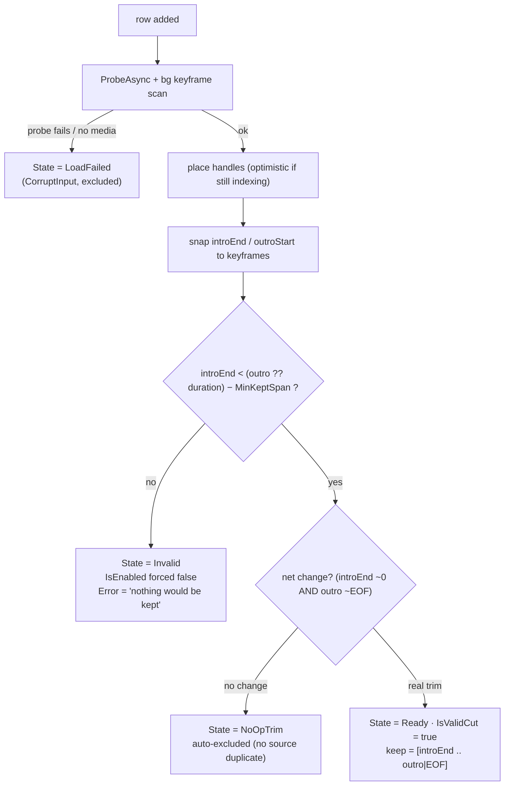
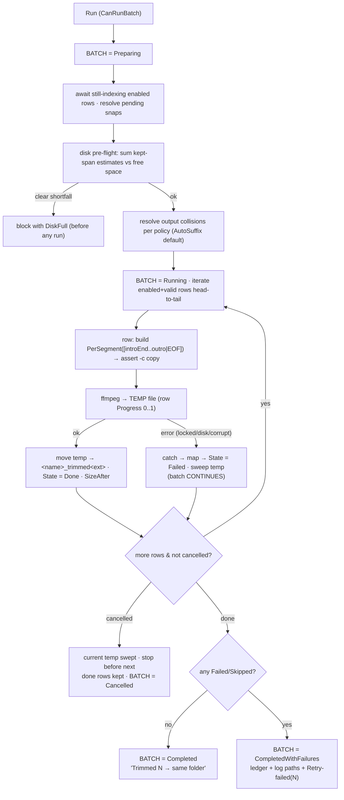

# D-004 · core flow — batch run, validation, edge matrix

Companion to [`./README.md`](./README.md). The run pipeline, the per-row/per-batch state machines, and the complete
edge-case → handling matrix (the source of the build's Case-Coverage Matrix).

## Per-row validation (recomputed on every handle/field change)

## Batch run (Run bulk cut)

**Why this shape:** each row is an **independent** temp-then-move `-c copy` of its own source — no cross-row coupling — so
failure isolation, mixed codecs, and partial cancel all fall out naturally. Cancellation cancels the in-flight ffmpeg and
sweeps its temp (a half file is **never** moved into place); already-`Done` rows are complete valid files and are kept.

## Full edge-case → handling matrix

| # | Case | Handling |
|---|------|----------|
| 1 | intro-end ≥ outro-start (empty/negative keep) | Snap-time `Invalid`; `IsEnabled` forced false; never builds a request (no 0-length file emitted). |
| 2 | cut point beyond duration | Snaps/clamps to last keyframe. intro past-end ⇒ empty keep ⇒ `Invalid`; outro past-end ⇒ `≈EOF` ⇒ no-outro warn. Never passes out-of-range time to ffmpeg. |
| 3 | intro snaps to ~0, no outro | Net full-file copy ⇒ `NoOpTrim`, auto-excluded (no source duplicate). If outro set, `[0..outro]` is a real tail trim ⇒ runs. |
| 4 | snapping moves the point noticeably | Per-handle `requested→snapped (±Δs)` shown (`CutMarkerViewModel`). Coarse GOP (>4s) ⇒ row Warning "cuts may move ~Xs". Snapped value is the shown truth. |
| 5 | outro snaps to EOF | Treated as no outro: omit `-to`, copy to EOF; Warning "nothing trimmed from the tail". Intro trim still applies; if intro also no-op ⇒ `NoOpTrim`. |
| 6 | output name collision (`_trimmed` exists) | Per policy at Preparing: `AutoSuffix`→`_trimmed_2/_3` (default) · `Skip`→`Skipped` · `Overwrite`→replace (only after ffmpeg succeeds, from temp). **Never** overwrites the source. |
| 7 | source locked / previewed in another tab | ffmpeg opens read-only; a shared FFME preview usually coexists. Genuine exclusive lock ⇒ that row `Failed` (mapped), batch continues. Attempt-and-isolate (no unreliable pre-block). |
| 8 | unsupported container / no keyframes | Probe fail ⇒ `LoadFailed` excluded. Probe ok but empty keyframes ⇒ keep RAW times, Warning "cut may not be clean"; run allowed (default) — stricter policy could disable. |
| 9 | one video fails mid-batch | Caught → mapped to that row's `Error` → `Failed`, temp swept, **loop continues**. End report `CompletedWithFailures` + per-file log paths. No successful row rolled back. |
| 10 | cancel mid-batch | In-flight ffmpeg cancelled, temp cleaned; token checked before next row. Done rows kept; not-started reset. Report "N trimmed, current rolled back, M not started". |
| 11 | re-adding the same file | Deduped by normalized `GetFullPath` on Add (a 2nd row would collide + confuse apply-to-all). Two cuts of one source = out of scope v1. |
| 12 | zero enabled rows | `CanRunBatch=false`; reason surfaced ("no rows" / "all invalid" / "still indexing"). Run is a no-op. |
| 13 | very short kept span | `KeptDuration < MinKeptSpan` ⇒ Warning "very short (~Xs)"; still allowed. `≤ epsilon` ⇒ `Invalid` (empty keep). |
| 14 | mixed codecs across batch | Non-issue by design — each row is an independent single-segment stream-copy; each output inherits its own source codec/container. |
| 15 | intro set, outro cleared | Primary case: `HasOutro=false` ⇒ keep `[introEnd..EOF]`, `PerSegment` end=null (omit `-to`). Valid when `introEnd < Duration − MinKeptSpan`. |
| 16 | disk full | Preparing pre-flight (`EnsureEnoughFreeSpace`) sums kept-span estimates vs free space ⇒ block early with friendly `DiskFull`. Mid-run ENOSPC (exit −28) ⇒ that row `DiskFull`/`Failed`, isolated (a smaller later file may still fit); truncated temp swept. |
| 17 | apply-to-all across uneven lengths | Copies **requested** times; each target **re-snaps + re-validates** against its own keyframes/duration. Rows where the copied time exceeds their (shorter) duration ⇒ `Invalid`/clamped, **reported not silently dropped**. Outro applied **from END** so varying-length series align. |

## Test surface (Core = WPF-free)

- `KeptSegmentSelector` — pure: resolves the kept plan index across drop/merge/snap (index-not-always-2 risk); or the
  direct-`PerSegment` path asserted `-c copy`.
- `BulkTrimEngine` (if in Core) — sequential loop over a **fake `ISplitEngine`**: failure isolation (row 2 throws ⇒ rows
  1,3 still `Done`), cancel (current swept, done kept), collision-policy resolution, disk pre-flight block.
- `BulkCutViewModel` / `BulkItemViewModel` — add/dedup, apply-to-all re-snap+re-validate per file (incl. outro-from-end),
  `IsValidCut`/`NoOpTrim` transitions, `CanRunBatch`, aggregate progress rollup — with fake `IMediaProbe` + fake engine
  (both already exist in the test suite).
- `CoreIsUiFreeTests` stays green — new Core types reference no WPF.
